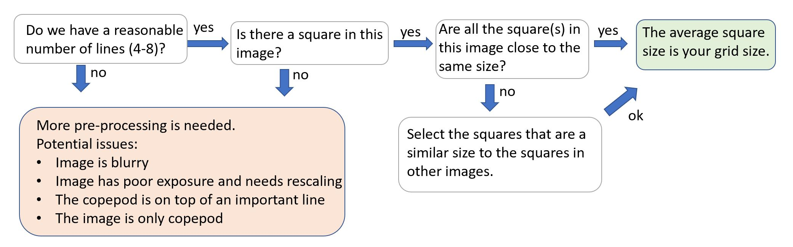

# Copepod Processing Spring 2020

This notebook is an attempt to summarize the work I have done this term on processing copepod images. Though I did not fully solve the probelm, I did make some good progress. 

The work I did was built on image processing skills gained from a scikit-image tutorial found here: https://github.com/scikit-image/skimage-tutorials. I completed the tutorials sequentially through lecture 4, and referenced those lectures and others as needed. 

## Initial attempt

My first pass at the problem of copepod detection focused on trying to solve the problem for a single image. [copepod_test_WORKS](copepod_test_WORKS.py) finds and measures the grid, then finds and measures the copepod in the image.

The main limitation of this code is that it *really* only works on the exact image it's built for. The thresholds that rescale the image for finding the copepod are set by hand, and I have no good way to generalize them. In addition, the gridline finder is also not super generalizable. I did a bit of exploring in isolating the copepods in new ways, but most of the rest of my work was taken up by trying to find good ways to accurately measure the grid.

## Helper module
As I worked, I found it helpful to maintain a module of helper functions. I call the module `copeproc` and tend to import it as `cp`. [Here's a link to the module](copeproc.py).

## Generalization for grid detection

Overall, the approach I used for detecting the gridlines remained consistent throughout the project: take an image, run canny edge detection on it, use `hough_line` to detect lines in the canny image, then try to figure out which lines matter. What varied was how I identified the lines that made up the grid. I found a lot of way to try doing that.

I wrote a couple of scripts focusing on a grid detection pipeline to allow myself dedicated space to mess with these ideas. They pretty much replicate the logic from the initial attempt code above, but are just a little more flexible. 

* [demodular_bulk_grid.py](demodular_bulk_grid.py) goes through all the steps of grid detection for each image
* [bulk_grid_detector.py](bulk_grid_detector.py) does each step for the full batch of images

### Explored paradigms
#### Thresholding
I tried using thresholding filters for both the gridlines and copepod detection. I found the [triangle threshold](https://scikit-image.org/docs/stable/api/skimage.filters.html#skimage.filters.threshold_triangle) tended to be the best global thresholding option. Overall, doing the threshold before canny and hough didn't seem to help much with the grid.

#### Grid peaks
I did quite a bit of work exploring the output of hough_line to see if I could use some kind of logic to accept lines that formed a grid and reject all others. I made reasonable progress with that. It worked extremely well in tests with constructed grid images, which you can see in [grid_hough](grid_hough.py), but fell a bit flat when applied to real images. It worked reasonably well on images with a clear grid, but failed to exclude images that were somehow out of the ordinary. 

The reason for that (I think) is that the grid-finding logic I wrote and included in copeproc didn't actually detect a grid, but rather detected any and all lines that were either parallel-ish or perpendicular-ish to any other line. I began fussing with making a new version to actually detect a grid, but moved on to square finding before getting very far in that department.

It's worth doing a serious explanation of Hough space here. I'll start by linking some resources.
* A very thorough [set of lecture slides](http://dept.me.umn.edu/courses/me5286/vision/Notes/2015/ME5286-Lecture9.pdf) on how the Hough transform works
* An excellent [video explaining Hough lines](https://youtu.be/4zHbI-fFIlI)
* If longform reading is more your style, [here's a nice summary of the topic](http://web.ipac.caltech.edu/staff/fmasci/home/astro_refs/HoughTrans_lines_09.pdf).
* And of course, the [skimage docs](https://scikit-image.org/docs/stable/auto_examples/edges/plot_line_hough_transform.html?highlight=hough) have their own explanation.

The main concept you really need in order to understand what's going on in the grid peaks attempt is the relationship between the image's coordinate space and the Hough coordinate space. The image is a Cartesian grid containing lines described by their x,y coordinates. These lines can also be described in polar coordinates - the line is then fully defined by ro, the shortest distance from the line to the top left corner of the image, and theta, the angle from the x axis (the top edge of the image) to that perpendicular from the origin to the line. The space of possible (theta,ro) pairs can then be visualized on its own Cartesian plane with ro on the vertical axis and theta on the horizontal. This plane is the Hough space. Thus a point in the Hough space corresponds to a line in the image space and vice versa.
This one-to-one relationship between lines in the image and points in the Hough space allows us to fairly easily do math on the relationships between the lines that would be more difficult if we had to relate the line equations in rectangular coordinates (see, the [very messy math](https://github.com/liocoa/COA-improc-workstudy/blob/cde118c8ad796f5a8f994aa0a9f2ee17f901afb5/copepod_test_WORKS.py#L135) in my code from early in the term). By calculating relationships between points in the Hough space (e.g. do they have the same angle? How far apart are they?) we can transfer that information back to our knowledge of the lines themselves.

#### Square finding
The last paradigm I tried before the term ended focused on measuring the grid without necessarily being able to draw it. This approach was intended to deal with the problem of identifying which intersections are adjacent to each other by merging the intersections problem with the grid finding problem. The process was changed from "find a grid, calculate the locations of the intersections, then somehow identify which intersections are one grid-side-length apart" to "look through all the sets of four lines and see if they make a square - if they do, measure it. That side length *could* be our grid size." This process is smoother because measuring the square is trivial; the side length is a piece of information obtained during the process of identifying the square.

I imagine square finding as part of a "low-hanging fruit" sort of algorithm. Though there are a lot of pesky images, many of them solve easily. Rather than writing logic to handle any possible outcome, all the images could be run through the simple square finder and sorted by whether or not they're likely to have worked, and all the ones that couldn't be measured with confidence go on to some other algorithm down the line. Something like this:

Unfortunately I didn't get to writing any of those other algorithms, but overall this direction feels promising. [square_finder](square_finder.py) is the code I wrote trying out this paradigm.

### Unexplored paradigms
#### Corner detection
There's a function called `corner_harris` in `skimage.feature` that detects corners using the Harris algorithm. I tried it without much success. Perhaps there could be some success with tweaking.

#### The Sudoku approach
I found an [intriguing stackoverflow answer](https://stackoverflow.com/a/48963987) about detecting a sudoku grid.

#### The Varience approach
In the [forum post](https://forum.image.sc/t/detecting-and-measuring-gridlines-with-skimage/37738) I made, someone suggested an interesting idea. Detect some lines, and then use [profile_line](https://scikit-image.org/docs/dev/api/skimage.measure.html#skimage.measure.profile_line) to measure the varience along each detected line. Basically, `profile_line` plots the intensity of an image over the given line, and the idea is that if a detected line fit well to a gridline, then the varience of the image's intensity along it woud be minimized. I messed with this a little, but I didn't get very far.

## Generalization for copepod detection
Most of my effort this term was on grid detection, but I did do some interesting work on detecting the copepods. I managed to get rid of gridlines and sort of separate copepods from other junk in [exploring_isolation](exploring_isolation.py).

I also did a bit of playing around with image rescaling in [rescale experimentation](rescale experimentation.py). I wanted to see if messing with the thresholds on rescale_intensity would help canny run better. Maybe it will with other values, but with the values I tried the results were actually worse.
